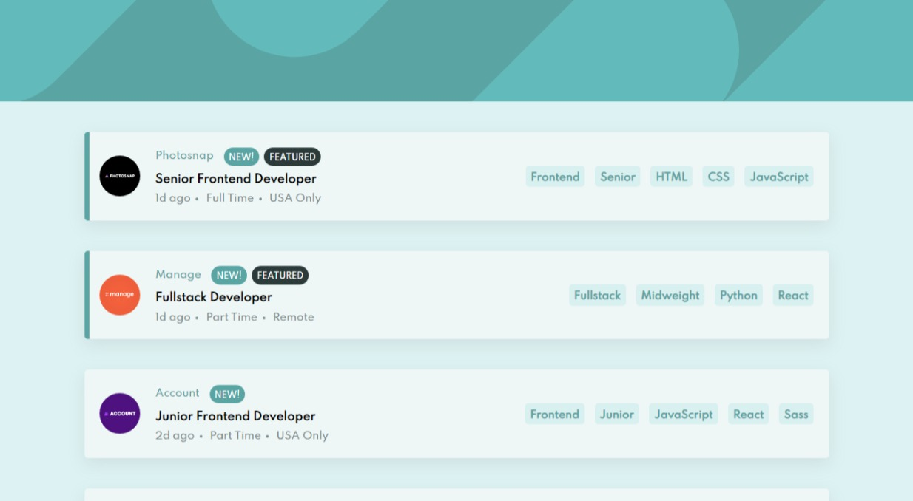

# Frontend Mentor - Job listings with filtering solution

This is a solution to the [Job listings with filtering challenge on Frontend Mentor](https://www.frontendmentor.io/challenges/job-listings-with-filtering-ivstIPCt). Frontend Mentor challenges help you improve your coding skills by building realistic projects.

## The challenge

Users should be able to:

- View the optimal layout for the site depending on their device's screen size
- See hover states for all interactive elements on the page
- Filter job listings based on the categories

## Screenshot



## Links

- Solution URL: [GitHub repo](https://github.com/JustShuaib/job-filter)
- Live Site URL: [Live site](https://job-filter-challenge.netlify.app/)

## Built with

- [React](https://reactjs.org/) - JS library
- [SASS](https://www.sass-lang.com) - For styling

## What I learned

Filtering the list based on the selected category was the challenging part of the project.
The code below shows how I did the filtering.

```js
const filteredList =
  filteredJobs.length === 0
    ? data
    : data.filter((item) =>
        filteredJobs.every(
          (filter) =>
            item.role.includes(filter) ||
            item.level.includes(filter) ||
            item.languages.includes(filter) ||
            item.tools.includes(filter)
        )
      );
```

## Useful resources

- [Filtering the list](https://github.com/tomhine/react-filtering-example) - I came across this repo on GitHub. It gave me a headstart on how to go aboout the filtering.

## Author

- Github - [Adeoti Shuaib](https://www.github.com/JustShuaib)
- Frontend Mentor - [@justshuaib](https://www.frontendmentor.io/profile/justshuaib)
- Twitter - [@JustShuaib](https://www.twitter.com/JustShuaib)
